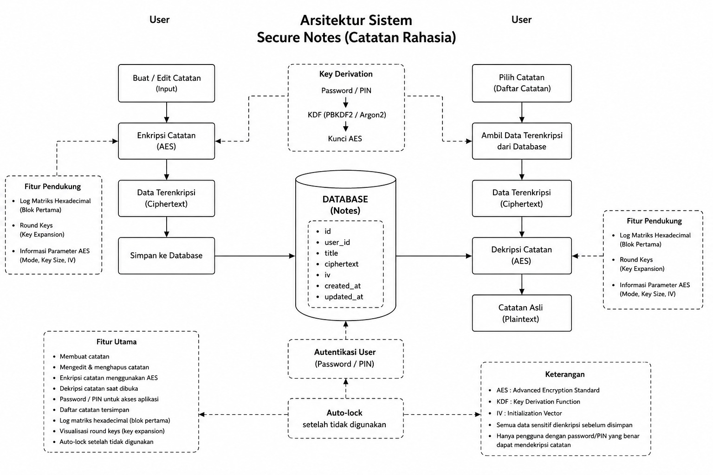
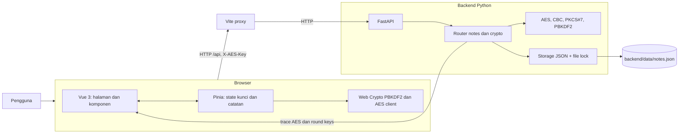

# Arsitektur Sistem SecretNotes

Dokumen ini menjelaskan komponen dan alur pada diagram arsitektur sistem, lalu mengaitkannya dengan implementasi aplikasi SecretNotes saat ini.



## Gambaran Umum

SecretNotes adalah aplikasi web single-user yang terdiri dari frontend Vue 3, backend REST FastAPI, dan penyimpanan file JSON lokal. Browser menyediakan antarmuka, mengelola kunci selama sesi, serta memiliki implementasi AES untuk enkripsi/dekripsi catatan dan animasi. Backend menyediakan API, validasi request, operasi kriptografi untuk kompatibilitas dan visualisasi, serta akses ke file penyimpanan.



## Komponen

| Komponen | Tanggung jawab |
| --- | --- |
| Browser dan Vue 3 | Menampilkan halaman passphrase, daftar catatan, editor, dan AES Lab. Vue Router mengatur navigasi dan membatasi halaman catatan jika state kunci belum tersedia. |
| Pinia stores | `crypto` menyimpan kunci dan status unlock; `notes` mengelola pemanggilan API, state daftar catatan, dan fungsi enkripsi/dekripsi yang dipakai antarmuka. |
| Kriptografi frontend | `aes-client.js` menyediakan AES-128-CBC, PKCS#7, IV, PBKDF2, serta fungsi trace untuk pengalaman visual. Kunci hasil derivasi digunakan di browser dan dikodekan Base64 ketika dikirim pada header API. |
| API client dan Vite proxy | `client.js` mengirim request ke path `/api`. Saat development, Vite meneruskan request tersebut ke backend sesuai konfigurasi proxy. |
| FastAPI | `main.py` membuat aplikasi API, memasang aturan CORS, menyediakan `/health`, dan mendaftarkan router catatan dengan prefix `/api`. |
| Router catatan | `routes/notes.py` memvalidasi header `X-AES-Key`, menerima operasi CRUD, menyediakan data ciphertext mentah, dan membentuk trace AES serta round keys. |
| Modul kriptografi backend | `crypto/kdf.py` menangani PBKDF2-HMAC-SHA256; `crypto/modes.py` menjalankan AES-CBC dan padding; `crypto/aes.py` mengimplementasikan AES-128, key expansion, dan trace ronde. |
| Penyimpanan | `storage.py` membaca dan menulis `backend/data/notes.json`. File lock digunakan ketika file dibaca atau ditulis agar akses bersamaan tidak saling bertabrakan. |
| File data | Setiap catatan menyimpan ID, ciphertext judul dan isi, IV masing-masing, serta waktu dibuat dan diperbarui. Plaintext tidak seharusnya menjadi format penyimpanan. |
| AES Lab | `AesLabView.vue`, `HexMatrix.vue`, dan `AesAnimation.vue` menampilkan matriks state AES, langkah enkripsi/dekripsi, dan 11 round keys. Data trace diperoleh dari API backend. |

## Alur Utama

### 1. Membuka sesi

1. Pengguna memasukkan passphrase pada halaman awal.
2. Frontend memeriksa panjang minimum lalu menurunkan kunci AES-128 menggunakan PBKDF2-HMAC-SHA256 melalui Web Crypto API.
3. Pinia menyimpan kunci dalam state sesi. Fungsi persistensi juga menaruh kunci dan passphrase di `sessionStorage`, sehingga keduanya dapat dipulihkan setelah reload selama sesi tab masih berlangsung.
4. Vue Router mengizinkan halaman catatan ketika state kunci tersedia.

Endpoint `POST /api/crypto/derive` juga tersedia di backend, tetapi alur unlock frontend saat ini melakukan derivasi langsung di browser dan tidak memanggil endpoint tersebut.

### 2. Membuat atau memperbarui catatan

Alur yang dimaksud adalah: editor menerima plaintext, frontend mengenkripsi judul dan isi secara terpisah dengan AES-128-CBC dan IV, lalu mengirim ciphertext Base64, IV, serta header `X-AES-Key` ke `POST /api/notes` atau `PUT /api/notes/{id}`. Backend menambahkan ID dan timestamp, kemudian menyimpan ciphertext dan IV ke JSON. Saat diperbarui, IV baru dibuat.

### 3. Membaca catatan

Frontend meminta daftar atau satu catatan melalui `GET /api/notes` dan `GET /api/notes/{id}` dengan header kunci. Backend membaca record dari JSON dan menggunakan kunci untuk memproses judul atau isi sebelum mengirim response. Untuk mengambil data terenkripsi apa adanya, frontend dapat meminta `GET /api/notes/{id}/raw`; response tersebut berisi ciphertext, IV, ID, dan timestamp.

### 4. Menghapus catatan

Frontend mengirim `DELETE /api/notes/{id}` dengan header kunci. Backend mencari ID, menghapus record dari daftar, lalu menulis kembali file JSON. Penghapusan bersifat langsung setelah konfirmasi pada antarmuka.

### 5. Melihat visualisasi AES

1. AES Lab memuat daftar catatan dan pengguna memilih satu catatan.
2. Frontend meminta data catatan, trace enkripsi, trace dekripsi, dan round keys ke endpoint backend.
3. Backend memproses blok pertama isi catatan untuk membuat trace langkah AES. Endpoint round keys menghitung key expansion AES-128 beserta informasi `RotWord`, `SubWord`, dan `Rcon`.
4. Frontend menyajikan hasil sebagai matriks hex dan animasi. Visualisasi blok pertama ditujukan untuk pembelajaran, bukan representasi seluruh isi catatan.

## Kontrak Data dan API

Endpoint utama yang menghubungkan frontend dan backend:

| Method | Endpoint | Fungsi |
| --- | --- | --- |
| `POST` | `/api/crypto/derive` | Menurunkan kunci dari passphrase; tidak digunakan oleh alur unlock frontend saat ini. |
| `GET` | `/api/notes` | Mengambil daftar catatan. |
| `POST` | `/api/notes` | Membuat catatan. |
| `GET` | `/api/notes/{id}` | Mengambil satu catatan. |
| `PUT` | `/api/notes/{id}` | Memperbarui catatan. |
| `DELETE` | `/api/notes/{id}` | Menghapus catatan. |
| `GET` | `/api/notes/{id}/raw` | Mengambil ciphertext dan IV tanpa dekripsi. |
| `GET` | `/api/notes/{id}/aes-log` | Mengambil trace enkripsi blok pertama. |
| `GET` | `/api/notes/{id}/aes-log-decrypt` | Mengambil trace dekripsi untuk visualisasi. |
| `GET` | `/api/notes/{id}/round-keys` | Mengambil 11 round keys dan trace key expansion. |

Semua endpoint catatan mengharuskan header `X-AES-Key` berisi kunci 16-byte yang dikodekan Base64. Header ini dipakai untuk operasi kriptografi, bukan autentikasi pengguna.

## Batas Keamanan

- File JSON dirancang menyimpan ciphertext dan IV, bukan plaintext. Metadata seperti ID dan timestamp tetap terlihat.
- Passphrase dan kunci dikelola pada browser, tetapi implementasi store menyimpan keduanya dalam `sessionStorage`. Keduanya dapat diakses oleh JavaScript yang berjalan pada origin aplikasi.
- Backend menerima kunci melalui header untuk operasi catatan; keberadaan header bukan mekanisme login atau otorisasi.
- Implementasi ini ditujukan untuk penggunaan lokal dan pembelajaran. Tidak tersedia autentikasi, manajemen multi-user, auto-lock, maupun sinkronisasi.

## Catatan Kesesuaian Implementasi

Ada dua perbedaan yang perlu diperhatikan ketika membandingkan diagram dengan kode saat ini:

1. Store frontend mengenkripsi catatan sebelum mengirimkannya, tetapi request create/update tidak mengirim `client_encrypted: true`. Backend hanya menyimpan ciphertext yang dikirim langsung ketika flag tersebut aktif; jika tidak, backend menganggap nilai request sebagai plaintext dan mengenkripsinya lagi. Akibatnya, perilaku CRUD aktual dapat berbeda dari alur enkripsi client-side yang dimaksud dan hasil yang tampil kembali dapat berupa ciphertext.
2. Proxy pada `frontend/vite.config.js` diarahkan ke `http://localhost:8001`, sedangkan petunjuk menjalankan backend di README menggunakan port `8000`. Samakan port target proxy dengan port backend yang sedang dijalankan agar request API tersambung.

## Struktur Modul

```text
frontend/src/
  api/client.js             # HTTP client untuk API
  crypto/aes-client.js      # PBKDF2 dan AES di browser
  stores/crypto.js          # state passphrase dan kunci
  stores/notes.js           # state dan operasi catatan
  router/index.js           # route dan penjagaan halaman
  views/                    # Passphrase, Notes, Editor, AES Lab
  components/               # visualisasi matriks dan animasi AES

backend/app/
  main.py                   # inisialisasi FastAPI dan CORS
  routes/notes.py           # endpoint catatan dan visualisasi
  schemas.py                # validasi request/response
  storage.py                # persistensi JSON dengan file lock
  crypto/                   # AES, CBC, padding, dan KDF

backend/data/notes.json     # penyimpanan catatan saat runtime
```