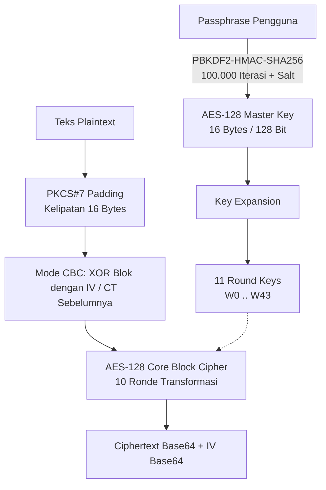

# Panduan Presentasi & Penjelasan Teknis Proyek SecretNotes
> **Dokumen Panduan Presentasi untuk Dosen Penguji / Pembimbing**  
> *Topik: Implementasi Algoritma Kriptografi AES-128, PBKDF2, dan Mode Operasi CBC pada Aplikasi Web Catatan Rahasia (SecretNotes)*

---

## Daftar Isi
1. [Ringkasan Proyek](#1-ringkasan-proyek)
2. [Tujuan dan Manfaat Aplikasi](#2-tujuan-dan-manfaat-aplikasi)
3. [Algoritma Kriptografi yang Digunakan](#3-algoritma-kriptografi-yang-digunakan)
   - [A. PBKDF2-HMAC-SHA256 (Key Derivation Function)](#a-pbkdf2-hmac-sha256-key-derivation-function)
   - [B. AES-128 (Advanced Encryption Standard - FIPS-197)](#b-aes-128-advanced-encryption-standard---fips-197)
   - [C. Mode Operasi CBC (Cipher Block Chaining)](#c-mode-operasi-cbc-cipher-block-chaining)
   - [D. Skema Padding PKCS#7](#d-skema-padding-pkcs7)
4. [Penjelasan Rinci Proses Matematis & Logika Algoritma](#4-penjelasan-rinci-proses-matematis--logika-algoritma)
   - [1. Key Expansion (Pembangkitan 11 Kunci Ronde)](#1-key-expansion-pembangkitan-11-kunci-ronde)
   - [2. Alur Enkripsi AES-128](#2-alur-enkripsi-aes-128)
   - [3. Alur Dekripsi AES-128](#3-alur-dekripsi-aes-128)
   - [4. Alur Mode CBC](#4-alur-mode-cbc)
5. [Di Mana Algoritma Ditempatkan (Pemetaan Kode Sumber)](#5-di-mana-algoritma-ditempatkan-pemetaan-kode-sumber)
   - [A. Sisi Frontend (Client-Side Crypto & Visualizer)](#a-sisi-frontend-client-side-crypto--visualizer)
   - [B. Sisi Backend (Python Manual Crypto & Trace Engine)](#b-sisi-backend-python-manual-crypto--trace-engine)
   - [C. Sisi Penyimpanan Data (Storage JSON)](#c-sisi-penyimpanan-data-storage-json)
6. [Alur Kerja Sistem (End-to-End Workflow)](#6-alur-kerja-sistem-end-to-end-workflow)
7. [Prediksi Pertanyaan Dosen & Jawaban Kunci (Q&A Defense)](#7-prediksi-pertanyaan-dosen--jawaban-kunci-qa-defense)
8. [Panduan Langkah Demo Saat Presentasi](#8-panduan-langkah-demo-saat-presentasi)

---

## 1. Ringkasan Proyek

**SecretNotes** adalah aplikasi pencatatan rahasia berbasis web yang menerapkan keamanan kriptografi simetris **AES-128 (FIPS-197)** dengan mode **CBC (Cipher Block Chaining)** dan penurunan kunci berbasis **PBKDF2-HMAC-SHA256**.

Keunggulan utama proyek ini adalah:
1. **Implementasi Manual Tanpa Library 'Black-box'**: Algoritma AES-128 (S-Box, perkalian Galois Field $GF(2^8)$, ShiftRows, MixColumns, AddRoundKey, Key Expansion) diimplementasikan secara mandiri dari nol baik di sisi JavaScript (Client) maupun Python (Backend).
2. **Visualisasi Transparan (AES Lab & Interactive Animation)**: Setiap tahapan matematis per ronde dapat divisualisasikan dalam bentuk matriks Hex ($4 \times 4$), animasi interaktif transformasi state, dan penelusuran Key Expansion.
3. **Pemisahan Enkripsi Judul & Isi Catatan**: Menggunakan *Initialization Vector* (IV) unik 16-byte untuk setiap bagian yang dienkripsi.

---

## 2. Tujuan dan Manfaat Aplikasi

### Untuk Apa Algoritma Kriptografi Ini Diterapkan?

1. **Kerahasiaan Data (*Confidentiality*)**:
   - Menjamin bahwa catatan yang disimpan pada media persisten (`notes.json`) berwujud *ciphertext* acak.
   - Pihak yang tidak memiliki *passphrase* (termasuk admin server atau pihak yang menyadap penyimpanan) tidak dapat membaca isi catatan.
2. **Perlindungan Terhadap Serangan Pola (*Pattern Attack Prevention*)**:
   - Penggunaan mode **CBC** dan **IV acak** memastikan teks yang sama yang dienkripsi dua kali akan menghasilkan *ciphertext* yang berbeda total.
3. **Instrumen Edukasi Kriptografi (*Educational Verification Tool*)**:
   - Membuka kotak hitam (*demystifying black-box cryptography*) dengan menyediakan penelusuran log State Matrix langkah demi langkah secara visual.

---

## 3. Algoritma Kriptografi yang Digunakan



---

### A. PBKDF2-HMAC-SHA256 (Key Derivation Function)
- **Fungsi**: Mengubah *passphrase* yang dimasukkan manusia (panjang bebas, mudah ditebak) menjadi kunci biner acak 128-bit (16 byte) yang seragam dan tahan terhadap serangan *dictionary / brute-force*.
- **Parameter**:
  - *Digest Algorithm*: SHA-256 (HMAC-SHA256)
  - *Salt*: Nilai salt biner (mencegah *Rainbow Table attack*)
  - *Iterations*: **100.000 iterasi** (memperlambat upaya serangan *offline brute force*)
  - *Derived Key Length*: **16 Bytes** (128 bit, sesuai spesifikasi AES-128).

---

### B. AES-128 (Advanced Encryption Standard - FIPS-197)
- **Karakteristik**:a
  - Tipe Cipher: *Symmetric Block Cipher* (kunci enkripsi dan dekripsi identik).
  - Ukuran Blok (*Block Size*): **128 bit (16 byte)**, direpresentasikan dalam **State Matrix $4 \times 4$ byte**.
  - Ukuran Kunci (*Key Length*): **128 bit (16 byte)**.
  - Jumlah Ronde (*Number of Rounds*): **10 Ronde**.

---

### C. Mode Operasi CBC (Cipher Block Chaining)
- **Fungsi**: Mengenkripsi data yang panjangnya lebih dari 1 blok (16 byte) secara berantai.
- **Mekanisme**:
  - Blok pertama di-XOR dengan **IV (Initialization Vector)** sebelum masuk ke cipher blok AES.
  - Blok berikutnya di-XOR dengan blok *ciphertext* sebelumnya.
- **Keunggulan vs ECB (Electronic Codebook)**:
  - Pada mode ECB, blok plaintext yang sama menghasilkan ciphertext yang sama persis (membocorkan pola). Mode CBC menghilangkan kelemahan ini.

---

### D. Skema Padding PKCS#7
- **Fungsi**: Menggenapkan panjang data agar tepat menjadi kelipatan 16 byte.
- **Aturan**: Jika kurang $N$ byte ($1 \le N \le 16$), tambahkan $N$ byte yang masing-masing bernilai byte $N$. Jika data sudah pas kelipatan 16, ditambahkan 1 blok penuh berisi 16 byte dengan nilai `0x10`.

---

## 4. Penjelasan Rinci Proses Matematis & Logika Algoritma

### 1. Key Expansion (Pembangkitan 11 Kunci Ronde)
Kunci 16-byte awal diperluas menjadi **11 Round Keys** ($11 \times 16 = 176$ byte) atau 44 kata 32-bit ($w_0$ sampai $w_{43}$):
1. $w_0, w_1, w_2, w_3$ diambil langsung dari 16 byte kunci awal.
2. Untuk setiap $w_i$ berikutnya ($i = 4 \dots 43$):
   - Jika $i$ kelipatan 4:  
     $w_i = w_{i-4} \oplus \text{SubWord}(\text{RotWord}(w_{i-1})) \oplus \text{Rcon}[i/4]$
     - **RotWord**: Menggeser siklik 4-byte kata ke kiri (`[a0, a1, a2, a3]` $\rightarrow$ `[a1, a2, a3, a0]`).
     - **SubWord**: Mensubstitusi tiap byte menggunakan S-Box.
     - **Rcon**: Konstanta ronde di Galois Field ($[0x01, 0x02, 0x04, 0x08, 0x10, 0x20, 0x40, 0x80, 0x1B, 0x36]$).
   - Jika $i$ bukan kelipatan 4:  
     $w_i = w_{i-4} \oplus w_{i-1}$.

---

### 2. Alur Enkripsi AES-128

Setiap blok 16-byte diatur dalam matriks State $4 \times 4$:

$$\begin{bmatrix} s_{0,0} & s_{0,1} & s_{0,2} & s_{0,3} \\ s_{1,0} & s_{1,1} & s_{1,2} & s_{1,3} \\ s_{2,0} & s_{2,1} & s_{2,2} & s_{2,3} \\ s_{3,0} & s_{3,1} & s_{3,2} & s_{3,3} \end{bmatrix}$$

1. **Ronde Awal (Ronde 0 - Pre-Round)**:
   - **AddRoundKey**: Melakukan operasi bitwise XOR antara State Matrix dengan *Round Key 0*.
2. **Ronde Standar (Ronde 1 sampai 9)**:
   - **SubBytes**: Substitusi non-linear setiap byte dalam state menggunakan tabel **S-Box** (berbasis invers multiplikatif di $GF(2^8)$ + transformasi afin).
   - **ShiftRows**: Pergeseran siklik baris state:
     - Baris 0: Tidak bergeser.
     - Baris 1: Geser ke kiri 1 byte.
     - Baris 2: Geser ke kiri 2 byte.
     - Baris 3: Geser ke kiri 3 byte.
   - **MixColumns**: Perkalian matriks modulo polinomial tak tereduksi $x^8 + x^4 + x^3 + x + 1$ di Medan Galois $GF(2^8)$ dengan matriks sirkulan tetap:
     $$\begin{bmatrix} s'_{0,c} \\ s'_{1,c} \\ s'_{2,c} \\ s'_{3,c} \end{bmatrix} = \begin{bmatrix} 02 & 03 & 01 & 01 \\ 01 & 02 & 03 & 01 \\ 01 & 01 & 02 & 03 \\ 03 & 01 & 01 & 02 \end{bmatrix} \begin{bmatrix} s_{0,c} \\ s_{1,c} \\ s_{2,c} \\ s_{3,c} \end{bmatrix}$$
   - **AddRoundKey**: XOR State dengan *Round Key* ronde tersebut ($RK_1 \dots RK_9$).
3. **Ronde Terakhir (Ronde 10 - Final Round)**:
   - **SubBytes**
   - **ShiftRows**
   - **AddRoundKey** ($RK_{10}$)  
   *(Catatan: Ronde 10 **TIDAK** menjalankan MixColumns).*

---

### 3. Alur Dekripsi AES-128
Dekripsi merupakan inversi operasi dengan urutan terbalik:
1. **Pre-Round**: `AddRoundKey` dengan $RK_{10}$.
2. **Ronde 9 turun ke 1**:
   - **InvShiftRows**: Menggeser baris ke arah kanan.
   - **InvSubBytes**: Substitusi menggunakan tabel **Inverse S-Box**.
   - **AddRoundKey**: XOR dengan $RK_i$.
   - **InvMixColumns**: Perkalian dengan matriks invers di $GF(2^8)$ ($[0E, 0B, 0D, 09]$).
3. **Ronde 0**:
   - **InvShiftRows**
   - **InvSubBytes**
   - **AddRoundKey** ($RK_0$).

---

### 4. Alur Mode CBC
- **Enkripsi**:
  $$C_0 = E_K(P_0 \oplus \text{IV})$$
  $$C_i = E_K(P_i \oplus C_{i-1}) \quad \text{untuk } i \ge 1$$
- **Dekripsi**:
  $$P_0 = D_K(C_0) \oplus \text{IV}$$
  $$P_i = D_K(C_i) \oplus C_{i-1} \quad \text{untuk } i \ge 1$$
  Setelah itu, $P$ dihapus padding PKCS#7-nya untuk memperoleh string plaintext asli.

---

## 5. Di Mana Algoritma Ditempatkan (Pemetaan Kode Sumber)

Berikut adalah struktur penempatan berkas algoritma kriptografi pada direktori proyek:

```
personal-secret-key/
│
├── frontend/src/
│   ├── crypto/
│   │   └── aes-client.js        <-- [UTAMA FRONTEND] Implementasi AES-128, CBC, KDF, S-Box manual JS
│   ├── stores/
│   │   ├── crypto.js            <-- State management kunci (Pinia) & sessionStorage
│   │   └── notes.js             <-- Enkripsi/dekripsi catatan lokal sebelum API request
│   ├── components/
│   │   ├── HexMatrix.vue        <-- Komponen visualisasi State Matrix 4x4
│   │   └── AesAnimation.vue     <-- Engine animasi visual per ronde (SubBytes, ShiftRows, dll)
│   └── views/
│       ├── NoteEditorView.vue   <-- Pemicu animasi enkripsi saat Save & dekripsi saat Open
│       └── AesLabView.vue       <-- Lab eksplorasi matriks enkripsi/dekripsi & Round Keys
│
└── backend/app/
    ├── crypto/
    │   ├── aes.py               <-- [UTAMA BACKEND] Implementasi AES-128 manual Python + Trace Engine
    │   ├── modes.py             <-- Mode operasi CBC & PKCS#7 Padding
    │   └── kdf.py               <-- PBKDF2-HMAC-SHA256 (100.000 iterasi)
    ├── routes/
    │   └── notes.py             <-- Endpoint API CRUD + Endpoint Trace Visualisasi (/aes-log, /round-keys)
    └── storage.py               <-- Pembacaan/penulisan notes.json dengan FileLock
```

### Detail Per File & Tanggung Jawabnya:

| Lokasi File | Fungsi Utama | Detail Komponen yang Diimplementasikan |
|---|---|---|
| `frontend/src/crypto/aes-client.js` | Kriptografi Client-Side | `S_BOX`, `INV_S_BOX`, `RCON`, `galoisMul()`, `subBytes()`, `shiftRows()`, `mixColumns()`, `addRoundKey()`, `keyExpansion()`, `encryptBlockWithTrace()`, `encryptCBCBase64()`, `deriveKeyPBKDF2()` |
| `backend/app/crypto/aes.py` | Kriptografi Server-Side & Trace Generator | Implementasi manual spesifikasi FIPS-197 dalam Python; menghasilkan array *state log* per langkah untuk disajikan ke UI Lab |
| `backend/app/crypto/modes.py` | Mode Operasi Block Cipher | `encrypt_cbc()`, `decrypt_cbc()`, `pkcs7_pad()`, `pkcs7_unpad()` |
| `backend/app/crypto/kdf.py` | Penurunan Kunci Server-Side | `derive_key()` menggunakan `hashlib.pbkdf2_hmac` dengan 100.000 iterasi |
| `backend/app/storage.py` | Penyimpanan Data Persisten | Menulis dan membaca `backend/data/notes.json` dalam format terenkripsi (ID, `title_ciphertext`, `title_iv`, `body_ciphertext`, `body_iv`, timestamp) |

---

## 6. Alur Kerja Sistem (End-to-End Workflow)

### Alur 1: Membuka Kunci (*Unlock Session*)
1. Pengguna memasukkan passphrase pada tampilan awal.
2. Frontend (`frontend/src/stores/crypto.js` memanggil `deriveKeyPBKDF2`) menjalankan PBKDF2 100.000 iterasi langsung di peramban pengguna.
3. Kunci 16-byte disimpan di memori Pinia store dan `sessionStorage` peramban.

### Alur 2: Membuat / Menyimpan Catatan (*Create Note*)
1. Pengguna mengisi *Judul* dan *Isi Catatan* di `NoteEditorView.vue`.
2. Frontend membangkitkan dua buah IV acak 16-byte (`title_iv` dan `body_iv`).
3. Teks dienkripsi secara lokal di browser menggunakan `encryptCBCBase64` (`aes-client.js`).
4. Animasi `AesAnimation.vue` berjalan menampilkan langkah enkripsi blok pertama.
5. Frontend mengirimkan payload JSON berisi *Ciphertext* Base64 dan *IV* Base64 beserta header `X-AES-Key` ke API endpoint `POST /api/notes`.
6. Backend menerima dan menyimpan ciphertext ke `notes.json`.

### Alur 3: Eksplorasi di AES Lab
1. Pengguna membuka menu **AES Lab** dan memilih catatan.
2. Frontend memanggil `GET /api/notes/{id}/aes-log`, `GET /api/notes/{id}/aes-log-decrypt`, dan `GET /api/notes/{id}/round-keys`.
3. Backend menjalankan enkripsi/dekripsi dengan flag `trace=True` dan mengirimkan riwayat State Matrix 4x4 pada setiap langkah (SubBytes, ShiftRows, MixColumns, AddRoundKey).
4. Frontend merender matriks interaktif dan representasi hex warna-warni.

---

## 7. Prediksi Pertanyaan Dosen & Jawaban Kunci (Q&A Defense)

### Q1: Mengapa membuat implementasi AES sendiri secara manual dan tidak memakai library standar seperti PyCryptodome atau Web Crypto AES-GCM?
> **Jawaban:**  
> "Tujuan utama proyek ini adalah aspek edukatif dan transparansi algoritma. Dengan membuat implementasi AES-128 dari tingkat primitif (tabel S-Box, operasi perkalian medan berhingga Galois Field $GF(2^8)$, rotasi baris, dan ekspansi kunci), kita dapat mengekstrak State Matrix di setiap mikro-langkah per ronde (*intermediate state*). Library bawaan atau hardware-accelerated crypto bersifat *black-box* yang tidak memungkinkan kita menginspeksi atau memvisualisasikan data matriks per tahapan ronde untuk pembelajaran."

---

### Q2: Mengapa memilih mode CBC dan bukan ECB atau GCM?
> **Jawaban:**  
> "Mode ECB tidak aman karena blok plaintext yang identik akan selalu menghasilkan ciphertext yang identik (rentan terhadap analisis pola frekuensi). Mode CBC mengatasi ini dengan mekanisme *chaining* (XOR dengan blok sebelumnya) dan penambahan IV acak. Kami memilih CBC karena alurnya sangat ideal untuk mendemonstrasikan prinsip dasar *diffusion* dan *confusion* pada mata kuliah kriptografi."

---

### Q3: Apa fungsi IV (Initialization Vector) dan apakah IV harus dirahasiakan?
> **Jawaban:**  
> "IV berfungsi sebagai nilai pengacak (*nonce*) untuk blok pertama pada mode CBC agar dua catatan dengan awalan teks yang sama tidak menghasilkan ciphertext blok awal yang sama. IV **tidak perlu dirahasiakan**, tetapi **harus unik dan tidak dapat diprediksi**. Oleh karena itu, IV disimpan secara terbuka dalam format Base64 bersama ciphertext di dalam database `notes.json`."

---

### Q4: Bagaimana perkalian pada langkah MixColumns dilakukan di komputer?
> **Jawaban:**  
> "Perkalian pada MixColumns bukan perkalian bilangan bulat biasa, melainkan perkalian polinomial di Medan Galois $GF(2^8)$ dengan irreducible polynomial $m(x) = x^8 + x^4 + x^3 + x + 1$ (`0x11B`).  
> Pada kode kami (`galois_mul` di `aes.py` dan `galoisMul` di `aes-client.js`), kami menerapkan algoritma *Russian Peasant Multiplication*: pergeseran bit ke kiri (`<< 1`) dan operasi bitwise XOR (`^= 0x11B`) jika terjadi *overflow* melewati derajat 8 (`0x100`)."

---

### Q5: Mengapa ada ronde yang tidak menggunakan MixColumns (Ronde 10)?
> **Jawaban:**  
> "Struktur Rijndael/AES dirancang sedemikian rupa agar proses enkripsi dan dekripsi memiliki kompleksitas simetris yang efisien. Peniadaan MixColumns pada ronde ke-10 membuat struktur cipher menjadi reversibel secara teratur tanpa mengurangi tingkat keamanan kriptografis, karena sifat difusi sudah tercapai penuh pada ronde-ronde sebelumnya."

---

### Q6: Bagaimana penanganan keamanan kunci pada arsitektur aplikasi ini?
> **Jawaban:**  
> "1. Kunci diturunkan dari passphrase menggunakan **PBKDF2 dengan 100.000 iterasi**, sehingga sulit ditembus serangan komputasi brute-force/rainbow table.  
> 2. Kunci berada di memori peramban klien dan hanya dikirimkan via header HTTP `X-AES-Key` (yang pada implementasi produksi harus dilindungi TLS/HTTPS).  
> 3. File data di server (`notes.json`) hanya menyimpan *ciphertext* dan *IV*, sehingga jika database dicuri (*data breach at rest*), data tetap tidak dapat didekripsi."

---

## 8. Panduan Langkah Demo Saat Presentasi

Untuk memberikan impresi yang sangat baik kepada dosen saat presentasi, ikuti skenario demo 5 menit berikut:

1. **Tahap 1: Tunjukkan Kondisi Terkunci & KDF**
   - Buka aplikasi pada browser (halaman Lock screen).
   - Masukkan *Passphrase* (contoh: `kuncirahasiaku123`).
   - Jelaskan bahwa tombol unlock menjalankan **PBKDF2-HMAC-SHA256** sebanyak **100.000 kali** untuk menghasilkan kunci 128-bit.

2. **Tahap 2: Buat Catatan & Demo Animasi Enkripsi**
   - Masuk ke menu **Buat Catatan**.
   - Masukkan judul dan isi catatan. Klik tombol **Simpan**.
   - Tunjukkan **Animasi AES Interaktif** yang muncul di layar:
     - Tunjukkan bagaimana teks diubah ke Hex.
     - Tunjukkan proses *Pre-Round* (XOR dengan IV lalu AddRoundKey).
     - Tunjukkan pergeseran matriks pada *SubBytes*, *ShiftRows*, *MixColumns*, dan *AddRoundKey* selama 10 ronde.

3. **Tahap 3: Buktikan File Penyimpanan Backend (Storage)**
   - Buka file `backend/data/notes.json` di editor / terminal.
   - Tunjukkan kepada dosen bahwa data yang tersimpan berwujud teks acak (*ciphertext*) Base64 dan bukan teks asli (*plaintext*).

4. **Tahap 4: Masuk ke Menu AES Lab (Fitur Utama Pembuktian Akademis)**
   - Buka menu **AES Lab**.
   - Tunjukkan **Key Expansion Tab**: Tunjukkan 11 Round Keys ($RK_0 \dots RK_{10}$) yang dihasilkan beserta trace `RotWord`, `SubWord`, dan `Rcon`.
   - Tunjukkan **Enkripsi Tab & Dekripsi Tab**: Geser *slider* ronde dari Ronde 0 hingga Ronde 10 untuk membuktikan bahwa data State Matrix berubah secara eksak sesuai rumus FIPS-197.

---
*Dokumen ini disusun untuk kelengkapan bahan presentasi dan sidang proyek kriptografi SecretNotes.*
